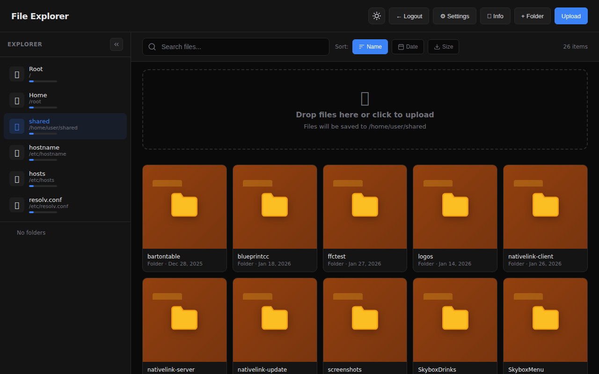
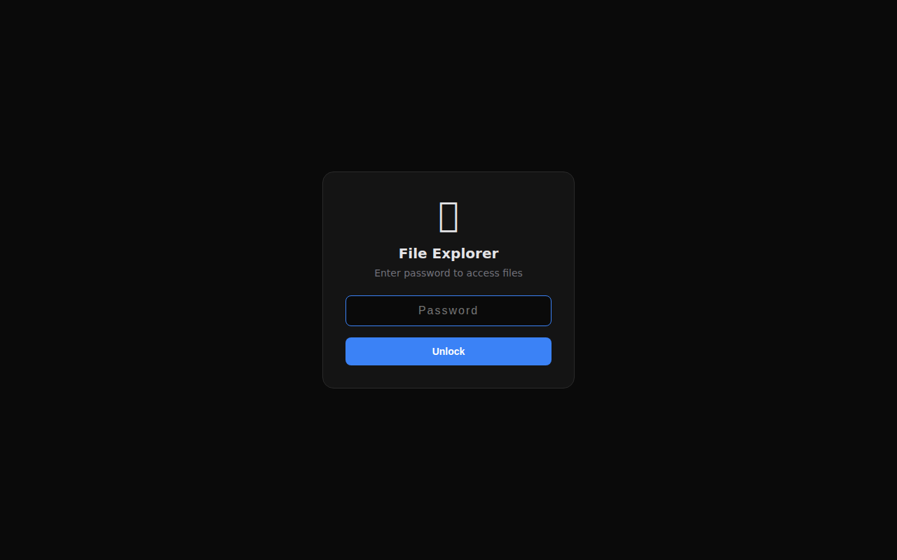
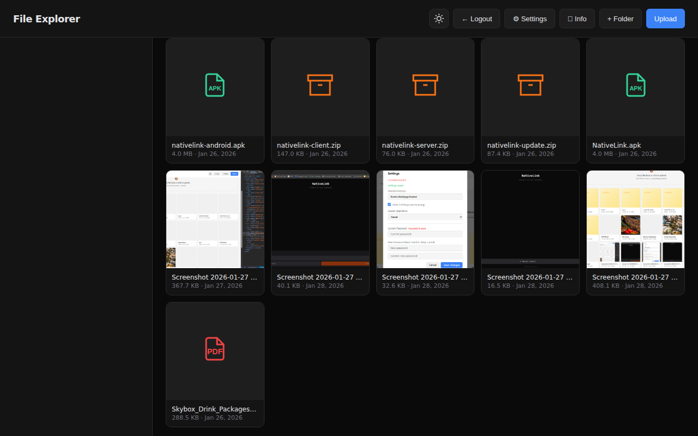
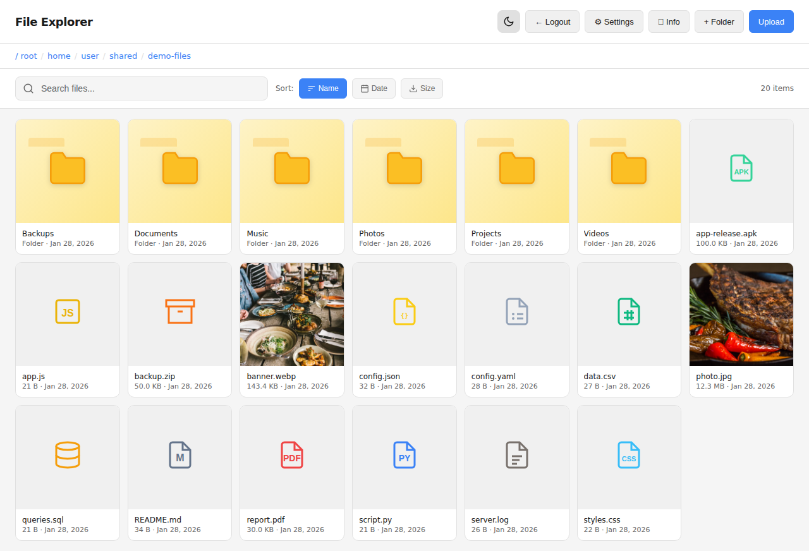
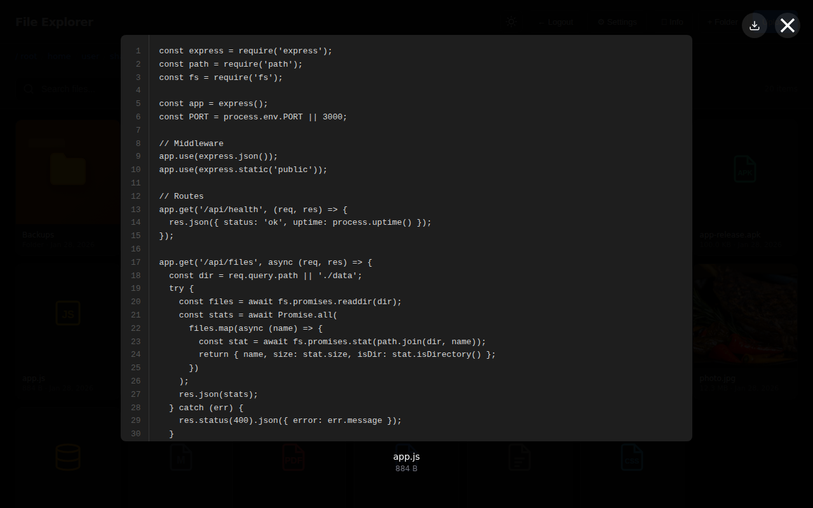
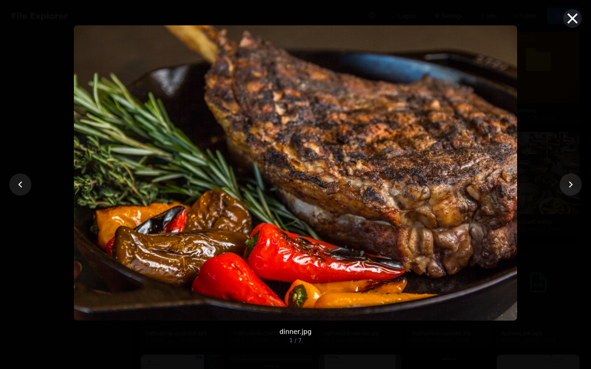

# File Share

**Browse, upload, and manage files on any machine from your browser.**

A self-hosted file sharing app that runs on your local network. Drop it on a server, NAS, or Raspberry Pi and access your files from any device. No cloud, no accounts, no tracking.



---

## Features

- **Grid file browser** — visual file cards with type icons, thumbnails, and metadata
- **Upload anything** — drag-and-drop or click to upload, up to 50 files at 500MB each
- **Media preview** — images with gallery navigation, video, audio, and text with line numbers
- **File operations** — create, rename, move, and delete files and folders
- **Multi-select** — Shift/Ctrl click for batch download, move, or delete
- **Drag to move** — drag files onto folders to reorganize
- **Search and sort** — filter by name, sort by name, date, or size
- **Batch download** — select multiple files and download as ZIP
- **Sidebar navigation** — folder tree with expand/collapse and mounted drives list
- **Dark and light theme** — toggle with one click, persisted in localStorage
- **Hidden files** — toggle to show or hide dotfiles
- **System info** — hostname, IP address, and disk usage in the status bar
- **Mobile optimized** — enterprise app bar with overflow menu for small screens
- **First-run setup** — browser-based wizard configures password and shared directory
- **Settings panel** — change password, paths, and session expiry anytime

## Quick Start

```bash
# Clone
git clone https://github.com/brobata/file-share.git
cd file-share

# Install
npm install

# Run
node server.js
```

Open `http://localhost:4040` in your browser. On first launch, you'll set a password and choose which directory to share.

## Docker

```bash
# Clone
git clone https://github.com/brobata/file-share.git
cd file-share

# Start (shares ~/shared by default)
docker compose up -d

# Or share a specific directory
HOST_SHARED_DIR=/path/to/files docker compose up -d
```

Access at `http://your-server:4040`.

### Docker with HTTPS

For standalone HTTPS using the built-in Caddy reverse proxy:

```bash
docker compose --profile https up -d
```

Edit `Caddyfile.standalone` to set your domain before starting.

## Screenshots

| Login | File Browser (Dark) |
|:---:|:---:|
|  |  |

| Files Grid | Light Theme |
|:---:|:---:|
|  |  |

| Text Preview | Image Gallery |
|:---:|:---:|
|  |  |

## How It Works

```
Browser                              Server (Node.js)
┌──────────────────────┐             ┌──────────────────────┐
│  Single-page app     │   REST API  │  Express 5           │
│  (vanilla HTML/JS)   │◄───────────►│  Multer (uploads)    │
│  Dark/light theme    │   JSON +    │  fs/promises          │
│  Responsive layout   │   files     │  Path security        │
└──────────────────────┘             └──────────────────────┘
```

- **Server** is a single `server.js` file — Express handles API routes, Multer handles uploads, native `fs` does file operations
- **Client** is a single `index.html` — no build step, no framework, just HTML + CSS + JS
- **Auth** uses SHA-256 hashed passwords with random salt and HMAC time-stamped tokens
- **Config** persists to `data/config.json` — survives restarts and container rebuilds

## Configuration

### Environment Variables

| Variable | Default | Description |
|----------|---------|-------------|
| `PORT` | `4040` | Server port |
| `SHARED_DIR` | `~/shared` | Root directory to share |
| `ALLOW_FULL_FILESYSTEM` | `false` | Allow browsing outside shared directory |
| `PASSWORD` | — | Set password on first boot (skips setup wizard) |

Environment variables take priority over `data/config.json`.

### Docker Volumes

| Mount | Purpose |
|-------|---------|
| `./data:/app/data` | Persists config (password, settings) across restarts |
| `/path/to/files:/data/shared` | The directory you want to share |

## Security

- **Password hashing** — SHA-256 with per-install random salt (never stored in plain text)
- **Auth tokens** — HMAC-based with configurable expiry (never, 1 day, 7 days, 30 days)
- **Rate limiting** — 5 attempts per minute per IP on auth and setup endpoints
- **Path traversal prevention** — all paths resolved and validated against allowed roots
- **Timing-safe comparison** — constant-time password verification
- **Filesystem isolation** — full filesystem access disabled by default, must be explicitly enabled

> File Share is designed for trusted local networks. For internet-facing deployments, put it behind a reverse proxy with HTTPS.

## API

| Method | Endpoint | Auth | Description |
|--------|----------|------|-------------|
| `GET` | `/api/status` | No | Check if setup is needed |
| `POST` | `/api/setup` | No | First-run configuration |
| `POST` | `/api/auth` | No | Login with password |
| `GET` | `/api/settings` | Yes | Get current settings |
| `POST` | `/api/settings` | Yes | Update settings |
| `GET` | `/api/info` | Yes | System info (hostname, IP, disk) |
| `GET` | `/api/drives` | Yes | List mounted drives/volumes |
| `GET` | `/api/tree` | Yes | Folder tree for sidebar |
| `GET` | `/api/list` | Yes | List directory contents |
| `POST` | `/api/upload` | Yes | Upload files (multipart) |
| `POST` | `/api/mkdir` | Yes | Create folder |
| `POST` | `/api/rename` | Yes | Rename file or folder |
| `POST` | `/api/move` | Yes | Move file or folder |
| `DELETE` | `/api/delete` | Yes | Delete file or folder |
| `GET` | `/api/download` | Yes | Download file or batch ZIP |

## Tech Stack

| Component | Technology |
|-----------|-----------|
| Server | Node.js, Express 5, Multer 2 |
| Client | Vanilla HTML, CSS, JavaScript (single file) |
| Auth | SHA-256, HMAC tokens, rate limiting |
| Container | Docker (node:20-alpine), Docker Compose |
| HTTPS | Caddy 2 (optional profile) |

## License

[MIT](LICENSE)
